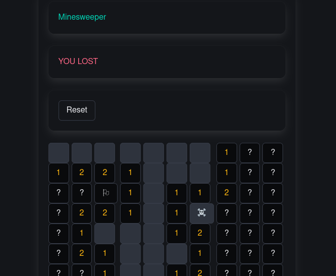

# F# Fable (javascript) Minesweeper game

A Minesweeper game implemented with F# Fable (javascript) and React.

## Try it yourself

### Prerequisites

Install the latest version of git,nodejs, and npm.

### In a shell

1. git clone git@github.com:tubbeg/fs-minesweeper.git
2. cd ts-minesweeper
3. npm install
4. npm run run-game